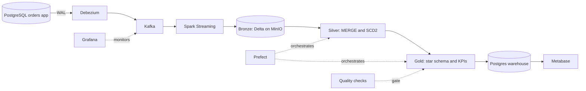

# Architecture

## Layers

| Layer | Content |
|---|---|
| Bronze | Raw change events (operation, before, after, timestamp), append only |
| Silver | Current state of each table, cleaned, with history for customers and products |
| Gold | Star schema and KPI tables, published to a warehouse for BI |

The status of each component is tracked in the README. This diagram describes
the target architecture, not what is built today.
